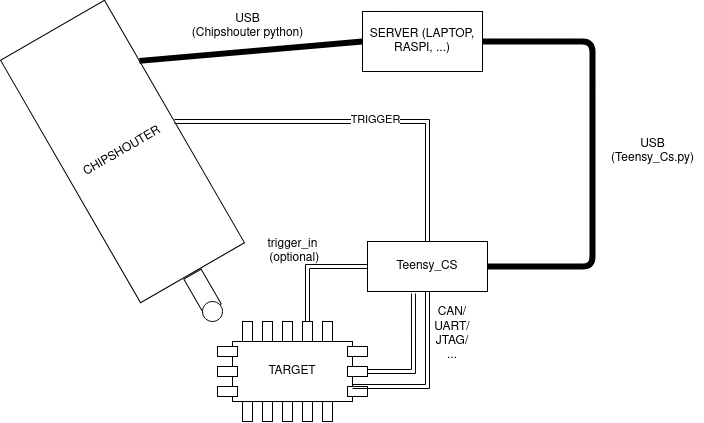

# ChipShouter library for TEENSY

This project aims to use a simple teensy (tested on Teensy 4.0 and 4.1) to act as an interface with the intended target & the [Chipshouter](https://github.com/newaetech/ChipSHOUTER). With a frequency of 600MHz, it is fast & accurate enough to inject glitches with a timing precision of ~50ns. From experience, this suffises for many targets. The advantage of using a Teensy instead of e.g. a [ChipWhisperer](https://rtfm.newae.com/Capture/ChipWhisperer-Pro/) is that it can support a range of protocols (CAN, UART, JTAG, ...) - and can be coded freely to the target's demands.

## Hardware
From a basic perspective, no extra hardware is needed. One GPIO pin acts as the trigger output to the chipshouter, and one GPIO pin can (optionally) act as a trigger input from the target. For an easier connection to the chipshouter SMB cable, an SMB female connector can be mounted on the teensy and connected to the trigger GPIO.

Additionally, certain targets (e.g. automotive) that require CAN will require the mounting of a CAN transceiver to interface with the target's CAN bus.

## Usage
[Teensy_Cs_setup](Teensy_Cs_setup.drawio.png) clarifies some of the setup. Central is one server controlling both the chipshouter as the teensy with a python interface. 



### Server
This setup requires one device coordinating the teensy, chipshouter, ... This is all done through python. The code for interfacing with the teensy is in `teensy_cs.py`. It provides the following functions (equivalent to the `Cs_Target::` functions below):

- `set_delay(delay)`: sets the delay for the teensy to inject the pulse. Affects the amount of time between `Cs_Target::pre_glitch` and `Cs_Target::post_glitch`.
- `setup_target`: calls `Cs_Target::prepare_target` on the teensy
- `run(trigger = 0, sync = 1)`: Initiates the glitch procedure on the teensy. Calls `pre_glitch`, delays for the set amount of time and then calls `post_glitch`. If sync = 0, then the procedure will not wait for a response (asynchronous). `read_async` can be called to fetch the result of the glitch in that case.

Logging can be enabled by enabling the `log` option in the constructor.


### Arduino side
`Cs_Target.h` defines 5 functions which need to be implemented specific to the requirements of the target.
- `Cs_Target::setup()`: gets called *once* when initialising the teensy. Use this for `pinMode`, initialise the communication interfaces, ...
- `Cs_Target::prepare_target()`: (optionally) called before starting the glitch proces. This can send some initial commands to get the target in the correct state for glitching. Used for when a glitch e.g. reset the target, before glitching starts, ...
- `Cs_Target::pre_glitch(uint8_t* ret_data, uint16_t* ret_len)`: This gets called first, meant to send a communication frame just before the moment the glitch is injected. After that, the library will delay & inject the glitch.
- `Cs_Target::post_glitch(uint8_t* ret_data, uint16_t* ret_len)`: Used to receive any input just after the glitch from the target. 
- `Cs_Target::check(uint8_t* ret_data, uint16_t* ret_len)`: If a glitch was successful, this can be used to read out memory, access registers, ... from the target. 


Main .ino file looks as follows:

```
#include < Teensy_Cs.h>

#define	TRIG_OUT	14

Cs_Target target;  // Cs_Target implemented in the same directory
Teensy_Cs t_cs(TRIG_OUT, &target);

void setup() {
	Serial.begin(115200);
	while(!Serial);
	Serial.println("Handing over control to Teensy_Cs");
	t_cs.run();
}

void loop() {
}

```


